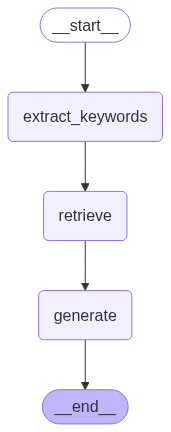

# Agenda {.agenda-slide}

1.  LLM Foundations
2.  RAG (Retrieval-Augmented Generation)
3.  LLM Agents
4.  LLM Evals
notes

# LLM Foundations {.section-slide background-image="pictures/nyc_wtc.jpg" background-size="cover" background-opacity="0.35"}

## What Is an LLM?

-   A large language model predicts the next token given some initial tokens.
-   Training objective: minimize next-token prediction error across massive text corpora.

LLM neural networks

> Text → Tokens → Token IDs → Embeddings → Transformer

## LLM Arhitecture


## Tokenization

-   Models do not read words directly; they read **tokens**.
-   A token can be a full word, subword, punctuation mark, or whitespace chunk.
-   Pricing, latency, and context limits are token-based.
    -   1 token ≈ 0.75 words or 1.33 $\times$ words
    -   \$2.50 / 1M tokens \| CI: \$0.25 / 1M tokens \| O: \$15.00 / 1M tokens
-   GPT-2's vocabulary has 50,257 unique tokens. [^1]

[^1]: Cho et al. (2024). *Transformer Explainer*. IEEE VIS. [poloclub.github.io/transformer-explainer](https://poloclub.github.io/transformer-explainer)

## Tokenization

-   Same sentence can produce different token counts across tokenizers.

``` python
text = "NotebookLM is a RAG app."
# conceptually:
# ["Notebook", "LM", " is", " a", " R", "AG", " app", "."]
```

## Tokenization

Open AI tokenizer

*https://platform.openai.com/tokenizer*

<iframe src="https://tiktokenizer.vercel.app" width="100%" height="600px" style="border:none;">

</iframe>

## Embedding Layers

-   Map discrete token IDs to continuous vector space.
-   Capture **semantic** relationships and contextual nuances.


::: {style="font-size: 0.5em;"}
*Semantic: relating to meaning in language or logic.*
:::

## Embedding Layers

Great Video from 3blue1brown

:::::: columns
::: {.column width="40%"}
<iframe width="315" height="560" src="https://www.youtube.com/embed/FJtFZwbvkI4" title="YouTube video player" frameborder="0" allow="accelerometer; autoplay; clipboard-write; encrypted-media; gyroscope; picture-in-picture" allowfullscreen>

</iframe>
:::

:::: {.column width="60%"}
<br><br>

::: {.callout-note icon="false"}
## 🤔 Question

Can we use this for classification?
:::
::::
::::::

::: {style="font-size: 0.5em; text-align: center;"}
[*Full 3Blue1Brown Playlist*](https://www.youtube.com/watch?v=aircAruvnKk&list=PLZHQObOWTQDNU6R1_67000Dx_ZCJB-3pi)
:::

## Transformers
Example: 

- "I deposited money at the _ _ _ _ "

- "I sat on the river _ _ _ _"

\n

-   Text-generative Transformer models operate on the principle of next-token prediction: given a text prompt from the user, what is the most probable next token (a word or part of a word) that will follow this input
- Transformes allows the LLM to understand understand things like based on *ALL* the tokens I have seen, what should each token mean in this specific *context*. 


## Transformers

- When I predict the next token, how much attention should the model pay to all the preceding tokens? 

- Attention blocks in tranformer models allow all tokens to talk to each other. 

- Within each Transformer block, the multi-head self-attention layer is what allows tokens to communicate with each other. 

- Without it, each token would be processed in isolation. The FFN layers that follow operate per-token, so attention is the only mechanism for inter-token information flow.


## Transformers 

::: {style="font-size: 0.5em; text-align: center;"}
*Source: Cho et al. (2024). Transformer Explainer. IEEE VIS. — [Click here](https://poloclub.github.io/transformer-explainer/){target="_blank"}*
:::

<iframe
  src="https://poloclub.github.io/transformer-explainer/"
  width="100%"
  height="580px"
  style="border:none;">
</iframe>


## Transformers

Attention Is All You Need

::::: columns
::: {.column width="50%"}
### Original Paper

<iframe src="https://arxiv.org/pdf/1706.03762" width="100%" height="550px" style="border:none;">

</iframe>
:::

::: {.column width="50%"}
### Annotated Implementation

<iframe src="https://nlp.seas.harvard.edu/2018/04/03/attention.html" width="100%" height="550px" style="border:none;">

</iframe>
:::
:::::

## The main take-aways


- LLM's are just recursively predicting the next token. 

- Preceeding tokens dictate the output proba. By adding "OH," probabbilty increases by double.

- Temp changes the probability distribution of the predicted tokens. Higher temp = more randomness.

## ChatGPT API

-   `temperature=0`: most deterministic decoding (lowest randomness).
-   `max_tokens`: hard cap on generated output length.
-   `reasoning_effort`: controls how much internal reasoning budget is used.
-   Tradeoff: higher quality often means more latency and cost.

``` python
response = client.responses.create(
    model="gpt-4.1",
    input="Summarize this report in 3 bullets.",
    temperature=0,
    max_output_tokens=120,
    reasoning={"effort": "medium"}
)
```

## State of Open-Source LLMs

-   Strong families: Llama, Qwen, Mistral, DeepSeek, and domain-specific variants.
-   Practical benefits: self-hosting, lower marginal cost, data residency control.
-   Typical constraints: hardware needs, ops complexity, eval/finetune overhead.
-   Common pattern: open-source for retrieval/structured steps, frontier API for hardest reasoning.


# RAG {.section-slide background-image="pictures/mumbai_x_pan.webp" background-size="cover" background-position="center" background-opacity="0.35"}

## Grounding to the Truth

-   We know that Base LLM knowledge – especially smaller models – can be stale or incomplete. Demonstrated by the Miami Example. 
-   We also know that preceeding tokens play a pivital role. Prompting and context becomes important. Think back to the "Miami(OH)," example. 

- I also assume that you know that giving your notes to an LLM as context and asking for a study guide is better than just asking for a study guide on a certain topic. 
  

::: {.callout-note icon="false"}
## 🤔 Question

Is there a way, everytime we ask LLM a question, it injects the right context into the prompt?
:::

## Retrieval Patterns: SQL & Vector

-   **SQL retrieval** for exact, structured data:
    -   transactional facts
    -   filtered records
    
-   **Vector retrieval** for semantic relevance:
    -   semantic matching and fuzzy mathing
    -   unstructured text


::: {.callout}
Can you combine both in the same app? 
:::

## Minimal RAG Flow (Pseudo-code)

``` python
query = "What changed in the policy this quarter?"
hits = retriever.search(query, top_k=5)
context = "\n\n".join([h["text"] for h in hits])
prompt = f"Answer using only this context:\n{context}\n\nQuestion: {query}"
answer = llm(prompt)
```

## Vector Stores

-   A vector store indexes embedding vectors alongside metadata for fast nearest-neighbor lookup.
-   At query time, your question is embedded into the same vector space, and the store returns the closest matching chunks.
-   Pre-filters (date, source, department) narrow the search space before similarity ranking runs.
-   Chunk size, overlap, and reranking strategy directly affect recall and precision — these are tunable knobs.
-   We will be using FAISS in our demo today. [^2]
-   Other popular options include Pinecone, MongoDB, Chromas

[^2]: Johnson, J., Douze, M., & Jégou, H. (2019). Billion-scale similarity search with GPUs. *IEEE Transactions on Big Data*, 7(3), 535–547. [github.com/facebookresearch/faiss](https://github.com/facebookresearch/faiss)

## Chunking Strategies
-  The way you split documents into chunks can make or break retrieval quality.
- For example, our museum data, each object is a point in the vector store. But if we are working with long documents, we might want to chunk them into sections or paragraphs.
-  Overlap is important to preserve context across chunk boundaries. A common heuristic is 200-300 tokens of overlap, but this depends on your data and retrieval needs.

## LangChain and LangGraph

-   **LangChain** provides modular abstractions — prompts, retrievers, tools, and chains — so you can swap components without rewriting glue code.
-   **LangGraph** extends this with stateful, graph-based workflows: define nodes, edges, and control flow for multi-step agentic pipelines.
-   Rule of thumb: if your task is a single retrieval → generate pass, LangChain alone is fine. If you need branching, retries, or loops, reach for LangGraph.


## LangGraph: Stateful Agent Graphs

:::: {.columns}

::: {.column width="50%"}
-   LangGraph models workflows as **directed graphs** where a shared state object flows through each step.
-   Each **node** is a plain Python function: it reads from state, does work (LLM call, retrieval, tool use), and returns the keys it wants to update.
-   **Edges** wire nodes together — fixed, conditional, or looping — giving you explicit control over execution order.
-   This makes multi-step tasks debuggable and reproducible: you can inspect state at every node boundary.
:::

::: {.column width="50%"}
```{.python code-line-numbers="false"}
builder = StateGraph(State)
# Nodes
builder.add_node("retrieve", retrieve)
builder.add_node("generate", generate)
builder.add_node("extract_keywords", extract_keywords)
# Edges
builder.add_edge(START, "extract_keywords")
builder.add_edge("extract_keywords", "retrieve")
builder.add_edge("retrieve", "generate")
builder.add_edge("generate", END)
# Compile & view
graph = builder.compile()
display(Image(graph.get_graph().draw_mermaid_png()))
```

{fig-align="center" width="30%"}
:::

::::


## State in LangGraph

-   State is a **`TypedDict`** — a typed Python dict that every node in the graph can read and write to.
-   Nodes return a *partial* dict with only the keys they want to update; LangGraph merges it back automatically.
-   **Reducers** control merge behavior per key. The default is last-write-wins, but `add_messages` appends instead — useful for building up a conversation history.
``` python
from typing import TypedDict, Annotated, List
from langchain_core.messages import AnyMessage
from langgraph.graph.message import add_messages

class State(TypedDict):
    messages: Annotated[list[AnyMessage], add_messages]  # appends each turn
    question: str       # overwritten each call
    documents: List[str]
    generation: str
```

## LangGraph: Nodes and Edges

:::::: columns
::: {.column width="50%"}
### Nodes
-   Any callable with signature `fn(state) -> dict`
-   Return only the keys you want to update — everything else stays untouched
-   Can call LLMs, retrievers, tools, APIs, or even nested sub-graphs
:::

::: {.column width="50%"}
### Edges
-   **Fixed**: `add_edge(a, b)` — always routes a → b
-   **Conditional**: `add_conditional_edges(a, router_fn)` — routes dynamically based on state values
-   `START` and `END` are built-in sentinels that mark entry and exit points
:::
::::::
``` python
def retrieve(state: State) -> dict:
    docs = retriever.invoke(state["question"])
    return {"documents": docs}          # only updates 'documents'

builder.add_conditional_edges(
    "grade",
    lambda s: "generate" if s["relevant"] else "retrieve",
)
```
## RAG in Practice: Art Museum Search 

-   Curators had to write exact SQL queries to search the collection — but records were often incomplete, inconsistently tagged or missing metadata entirely.
-   Exact-match SQL fails when the data is messy. A search for "black and white portrait photography" returns nothing if the record only says "gelatin silver print, 1940."
    -  Vector Embeddings capture semantic similarity, so the retriever can surface relevant records 
-   The goal: replace rigid SQL lookup with natural language retrieval.[^3]

[^3]: Github Repo *RAG Omeka: Natural Language Retrieval for Art Museum Collections*. [github.com/fryan2503/rag_omeka](https://github.com/fryan2503/rag_omeka)

## Visualizing the Vector Store

<iframe src="assets/vectorstore_3d.html" width="100%" height="600px" style="border:none;">
</iframe>

## NotebookLM Is a RAG App

-   You provide docs.
-   It indexes and retrieves relevant chunks.
-   It answers with source-grounded context.
-   This is RAG behavior, wrapped in a consumer-friendly interface.


# LLM Agents {.section-slide background-image="pictures/sb_audi.jpg" background-size="cover" background-opacity="0.35"}

## Agency

-   an agent is an LLM that can autonomously take actions in a loop (tool use, code execution, web browsing), plan multi-step tasks, and course-correct based on feedback
-   Agentic behavior is useful when tasks require multi-step decisions.

## Simple Agent: SQL Tooling

-   Pattern: user question -\> intent parsing -\> SQL generation -\> execution -\> final answer.
-   Risk: SQL injection, unsafe queries, and accidental data exposure.
-   Controls:
    -   allowlisted tables/columns
    -   parameterized queries
    -   read-only DB roles
    -   query validators before execution

## MCP (Model Context Protocol)

-  MCP standardizes how models discover and use external tools/context.
-  Think of it as a common interface between model runtimes and tool servers.
-  Before USB C and Thunderbolt, every device had its own weird plug. MCP is the USB C of model-tool integration.
- That's what AI tool integration was like before MCP — every tool (Slack, Google Drive, Notion) needed its own custom integration code.


## MCP Example 
```{.python}
# MCP Server: expose a tool
@server.list_tools()
async def list_tools():
    return [Tool(name="get_weather", inputSchema={...})]

@server.call_tool()
async def call_tool(name, arguments):
    return get_weather(arguments["city"])

# MCP Client: discover and use it
tools = await session.list_tools()        # "What can you do?"
result = await session.call_tool(         # "Do this thing"
    "get_weather", {"city": "Cincinnati"}
)
```
## Auto Research — Recursive Agent Example

:::: {.columns}

::: {.column width="50%"}
-   The core idea: give an AI agent a small but real LLM training setup and let it experiment autonomously overnight. It modifies the code, trains for 5 minutes, checks if the result improved.
-   I forked this repo and ran it for our 591 project. The agent ran 20 experiments overnight and 2 saw small improvements in the target metric. [^4]
:::

::: {.column width="50%"}
<iframe src="https://platform.twitter.com/embed/Tweet.html?id=2031135152349524125" 
        width="550" height="500" style="border:none;" allowfullscreen>
</iframe>
:::

::::

[^4]: *Auto Research Fork*. [github.com/fryan2503/autoresearch](https://github.com/fryan2503/autoresearch)


# LLM Evals {.section-slide background-image="pictures/hall.jpg" background-size="cover" background-opacity="0.35"}

## What Is Right or Wrong?

-   Define task-specific rubrics before testing.
-   Separate objective checks (exact match, schema validity) from subjective checks (tone, clarity).
-   Require evidence/citations for factual outputs where possible.
-   Without a rubric, you're grading with vibes.

## Deterministic vs. Non-Deterministic Questions

-   **Deterministic**: one correct answer. "How many paintings?" → 644. Gradeable with exact match. 
-   **Non-deterministic**: many valid answers. "Describe the African art." Requires judgment.
-   Most real-world RAG questions are non-deterministic — this is what makes LLM evals hard.
-   Your golden set should include **both types** so you know where your system is strong and where it's fuzzy.

| Type | Example | Grading |
|---|---|---|
| Deterministic | "How many paintings?" | Exact match / simple comparison |
| Non-deterministic | "Describe the African art" | LLM-as-judge or human review |

## Randomness and Determinacy

-   LLM outputs vary due to sampling and model uncertainty.
-   `temperature=0` improves repeatability but does not guarantee identical output.
-   Even the *same* deterministic question can get different wording across runs.
-   This is why LLM evals require repeated runs and distributions, not single samples.

## Accuracy, Latency, Cost

-   Quality alone is not enough; track all three.
-   **Accuracy**: does the model answer correctly?
-   **Latency**: fast enough for the user experience?
-   **Cost**: sustainable per request and at scale?

## LLM as a Judge

-   Use a strong model to score outputs against a rubric.
- LLM's are really good at spotting incosistencies between 2 given texts.
-   Two criteria we'll use:
    -   **Helpfulness**: Is the answer relevant and concise?
    -   **Correctness**: Does it match the gold answer factually? This is more important.
-   Watch for judge bias and rubric leakage. 
-   There has been instances if the LLM knows it is being graded, it will try to cheat on the test or won't take it seriously. [^5]

[^5]: Claude Opus cheating on browsecomp [Eval awareness in Claude Opus](https://www.anthropic.com/engineering/eval-awareness-browsecomp)


## Golden Set (How We did it for the research project)

1.  We had a team of 8 students, professors and phd candidates manually curate a set of 100 questions related to machinery, like a CNC lathe or Mill.
2.  Our questions were non-determinitic only. 
3.  Each question was sent to a subject matter expert (SME) for revision. We had a safety consultant review all the questions.

## Continuous Evals

-   Notice the like/dislike buttons on ChatGPT responses? Those are user feedback signals that feed into OpenAI's eval system.
-   Also i'm sure you notice the A/B tests now too 
-   This is a good way to understand where the Agent failed and how to improve it.
-   For example, if users consistently dislike responses to a certain question, that signals a weakness in the retrieval or generation for that query type. You can then add more examples of that question type to your eval set and iterate on improving it.